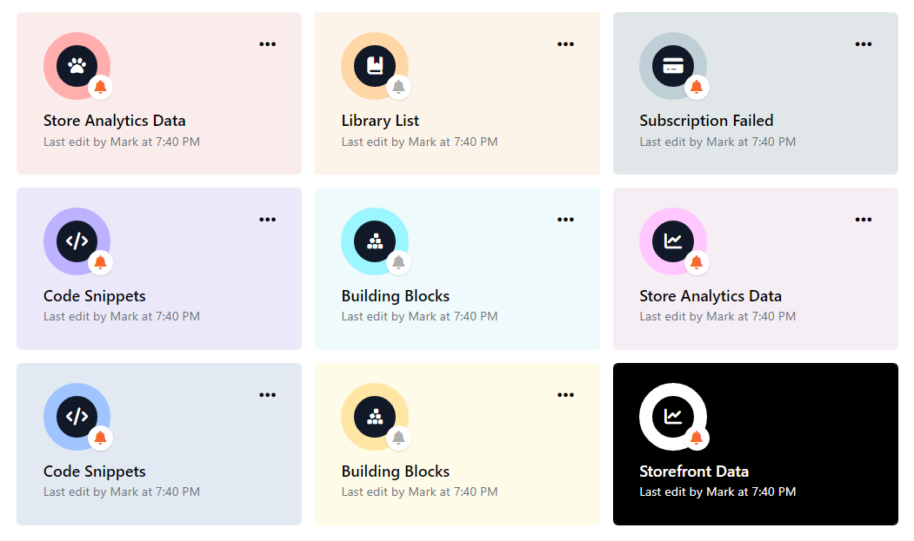

# Dribbble UI Interpretations — w/ HTML & TailWindCSS &nbsp;&nbsp;

## About

This repository is intended to show my interpretations of web mockups from dribbble.com. All credits are given where due.

This repository is also meant to help beginning and intermediate front-end developers grasp the concepts of front-end web development.

I work alone and I'm unemployed at the moment, so this repository doubles as my portfolio. If you find this repository helpful please consider giving it a star so that others can find it more easily. Thanks.

This is a work in progress, so please keep checking back.

## Screenshots 📸

### Credit: Emy Lascan

**Design Shot:** https://dribbble.com/shots/18211526



## How to Run 👇

1. Clone repository and `cd` into folder:

```
git clone https://github.com/Chizaram-Igolo/dribbble-interpretations.git
cd dribbble-interpretation
```

2. Run `npm install`

3. Open the folder in another terminal and run `npm run build-css` to produce output css and watch for changes. (See _scripts_ entry in package.json file for the build script)

4. Open folder in your favourite editor (e.g VSCode) and start a live server and navigate to `dribbble-uis` folder in your favourite browser to open a project.
